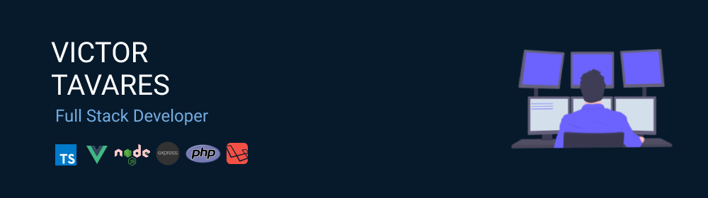

 
Languages
 
<table align="right" margin="20">
 <tr><td><a href="README_en.md">English</a></td></tr>
 <tr><td><a href="README.md">Português</a></td></tr>
</table>

## 🛠 Tecnologias & Ferramentas

&nbsp;&nbsp;
&nbsp;&nbsp;
&nbsp;&nbsp;
&nbsp;&nbsp;
&nbsp;&nbsp;
&nbsp;&nbsp;
&nbsp;&nbsp;
&nbsp;&nbsp;
&nbsp;&nbsp;

## 📩 Contato

  
 
 

 

 
